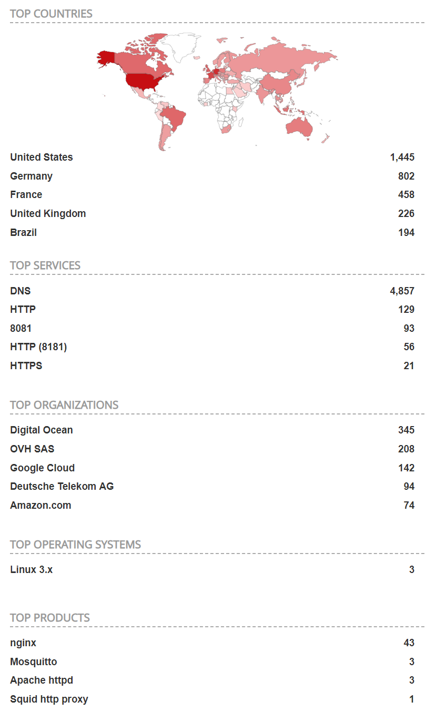

There are 5308 publically available Pi-Holes according to [Shodan.io](https://www.shodan.io/search?query=pi-hole). This article will demonstrate how bad of an idea this is.

If you've spent any time over at [r/pihole](http://reddit.com/r/pihole), you'll know they always talk about not having publically available Pi-Holes. But, why? What's the harm?

Out of the 5308 Pi-Holes publically available, I found 100 of them are vulnerable. Vulnerable means:
1. You can access /admin/index.php?login.
This is because not all Pi-Holes listed by Shodan work in the way we expect them to.

However, in my research I came across something interesting:
# Passwordless Pi-Holes
I came across many passwordless Pi-Holes. 578 passwordless Pi-Holes to be correct. These aren't considered "vulnerable", because they are by default open.
It's incredibly easy to find these, if you click around on Shodan enough you'll find them. You can also search the Shodan API (like I did below) and try to access a page, `/admin/queries.php` and see if it doesn't prompt for a password.
Some of these Pi-Holes are meant to be public. You can tell because their domain name includes "public-pihole". 

It's hard to differentiate between Pi-Holes meant to be publically accessible and those that aren't, so I haven't explored these much. Just know that these exist and to not make a publically facing Pi-Hole without a password for your personal use.

# Finding these Pi-Holes
Shodan.io is a service that scans the web. It finds IoT or other devices like Pi-Hole. Using the Shodan API, we can programatically explore these Pi-Holes. Or, you can [click here](https://www.shodan.io/search?query=pi-hole) and explore them manually.

Finding these Pi-Holes took a minimal amount of code. I was surprised to find my Pi-Hole on this list. You need a Shodan membership. Also, don't attack Pi-Holes you don't own.

```python
from shodan import Shodan
import requests
api = Shodan('API_KEY')

def url_ok(url):
    r = requests.head("http://" + url)
    return r.status_code == 200

def check_page(url):
    r = requests.get("http://" + url + "/admin/")
    return "Pi-hole" in r.text

def pruneIPS(vulnerableIPs):
    for i in vulnerableIPs:
        if not url_ok(i):
            if not check_page(i):
                vulnerableIPs.remove(i)
    return vulnerableIPs

result = api.search("pi-hole")

VulnerableIP = []
for service in result['matches']:
    VulnerableIP.append(service['ip_str'])
```

Pi-Hole doesn't block bruteforcing. You can enter 200,000 incorrect passwords and Pi-Hole wouldn't care. How easy is it to create a brute-force attack? With Hydra - very easy.
Hydra is a brute-forcing tool that uses a dictionary to attack a target. The payload for brute-forcing a Pi-Hole is:

```
hydra -l '' -P /usr/share/wordlists/rockyou.txt 192.168.0.1 http-post-form "/admin/index.php?login:pw=^PASS^:Forgot password"```
```
Our wordlist is the infamous [rockyou.txt](https://www.kaggle.com/wjburns/common-password-list-rockyoutxt). We use the http-post-form module and enter some information. The form to post, the name of the variable for the password ("pw"), and what will be on the page when a failed login attempt happens (the forgotten password box).

Since Pi-Hole doesn't block brute-force attacks, it makes it trivial to brute-force most of the Pi-Holes assuming password length is low (under 9 chars optimally, although 9 chars can be done in 19 hours https://howsecureismypassword.net/). It's worth mentioning that Pi-Hole's default password is very secure, but the lack of any timeouts sucks. Not to mention that most people change their password to something more human.

To recap, it is possible to get a list of all the vulnerable Pi-Holes and to brute-force their passwords with a dictionary attack. 

I will not show code for this, because it is illegal. However, you can see the 2 separate parts in action above.

# What can an attacker see?
Once the attacker has gained access to your Pi-Hole, they can see every website you visit. Your hosts' files, your clients and their IP addresses. Your top domains and your top blocked domains. 

Now, they have a pretty good idea of who you are. They know all your devices. They know your password (which, most people would reuse on at least one of their devices). And they know you, pretty well actually.
Considering your entire internet history is there.
**There is no point in using a Pi-Hole if all of your DNS information is as easily accessible as this.**

## DNS Amplification Attacks
An attacker could use your DNS server to perform a DDoS attack. This is very common and is called a [DNS amplification attack.](https://www.cloudflare.com/learning/ddos/dns-amplification-ddos-attack/)
This is likely illegal for you to allow this, depending on the country. Another reason to not use a publically facing Pi-Hole.
# How to protect yourself
Firstly, check if your Pi-Hole is publically accessible.
Search your IP address on Shodan.io. Read the output. Shodan will tell you what ports are open, and will let you know whether it thinks a Pi-Hole service is running.

1. Use a VPN to connect to your Pi-Hole:
https://www.reddit.com/r/pihole/comments/bl4ka8/guide_pihole_on_the_go_with_wireguard/
2. Don't have a publically facing Pi-Hole
3. Choose a very strong password
4. Turn your Pi-Hole into a no-logs Pi-Hole

# Fun Facts
Statistically, most people with exploitable Pi-Holes used Deutsche Telekom AG. However, most publically accessible Pi-Holes are hosted on:
1. Digital Ocean
2. OVH SAS
3. Google Cloud
4. Deutsche Telekom AG



Follow me on Twitter:
[https://twitter.com/BeeeSec](https://twitter.com/BeeeSec)
